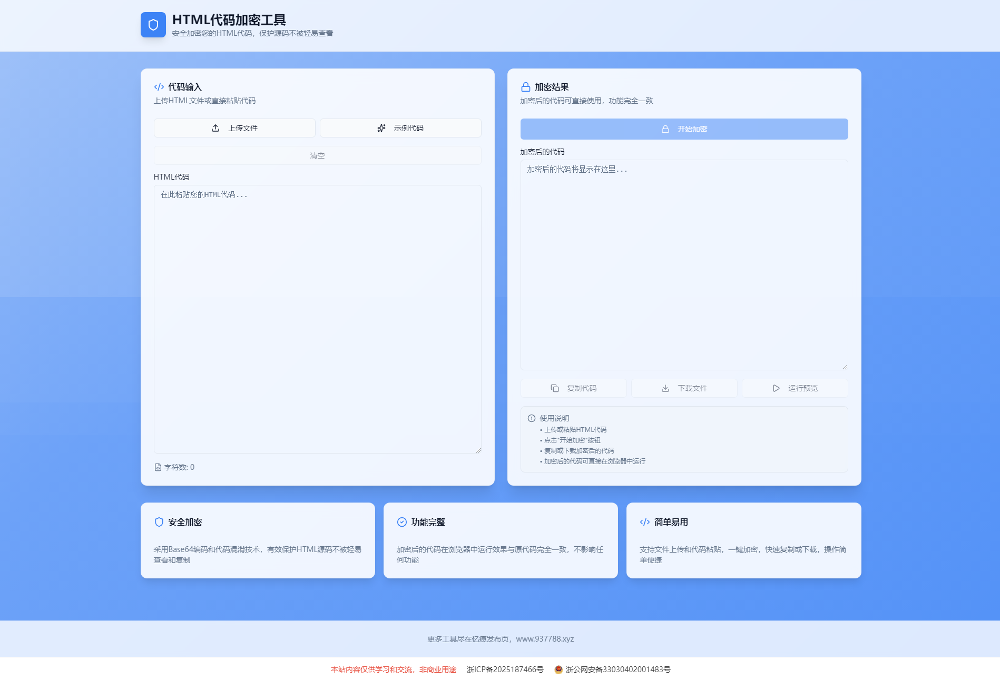

# HTML代码加密工具

## 项目简介

HTML代码加密工具是一款基于 React + Tailwind CSS 构建的在线工具，用于将 HTML 源代码进行加密保护，防止源码被轻易查看和复制。

演示地址：https://htmljiami.937788.xyz/

## 主要功能

- **HTML代码加密** — 采用 Base64 编码和代码混淆技术，对 HTML 源码进行加密处理
- **文件上传** — 支持上传 `.html` 文件，自动读取并加密
- **示例代码** — 内置完整的动态效果示例，方便快速体验加密功能
- **一键复制** — 加密后的代码可直接复制到剪贴板
- **文件下载** — 支持将加密后的代码下载为 `.html` 文件
- **运行预览** — 内置 iframe 预览功能，可实时查看加密代码的运行效果
- **进度提示** — 加密过程带进度条和动画反馈

## 技术栈

- **React 18** — 前端框架
- **React Router 6** — 路由管理
- **Tailwind CSS** — 原子化 CSS 框架
- **shadcn/ui** — UI 组件库
- **Radix UI** — 底层 UI 原语
- **Sonner** — Toast 通知组件
- **Lucide React** — 图标库

## 加密原理

1. 将用户输入的 HTML 代码进行 `encodeURIComponent` + `btoa` Base64 编码
2. 生成一个包含加载动画和解密逻辑的外壳 HTML 文件
3. 浏览器加载时自动执行解密脚本，动态还原原始页面内容
4. 解密后重新触发 `DOMContentLoaded` 事件，确保所有脚本正确执行

## 文件结构

```
├── index.html          # 入口 HTML 文件
├── index-ioB0BHD-.js   # 打包后的主 JS 文件（React 应用）
├── index-CmRiEske.css  # 打包后的样式文件
└── fonts-code.css      # 字体文件
```

## 使用方法

1. **上传文件**：点击「上传文件」按钮，选择本地的 HTML 文件
2. **粘贴代码**：直接在左侧文本框中粘贴 HTML 代码
3. **加载示例**：点击「示例代码」按钮，加载内置的演示代码
4. **开始加密**：点击「开始加密」按钮，等待加密完成
5. **复制/下载**：加密完成后，可复制代码或下载为 HTML 文件


## 注意事项

- 加密后的 HTML 文件功能与原代码完全一致
- 支持包含 CSS、JavaScript 的完整 HTML 页面加密
- 加密后的代码可直接在浏览器中打开运行
- 建议使用现代浏览器（Chrome、Firefox、Edge、Safari）访问

## 截图


